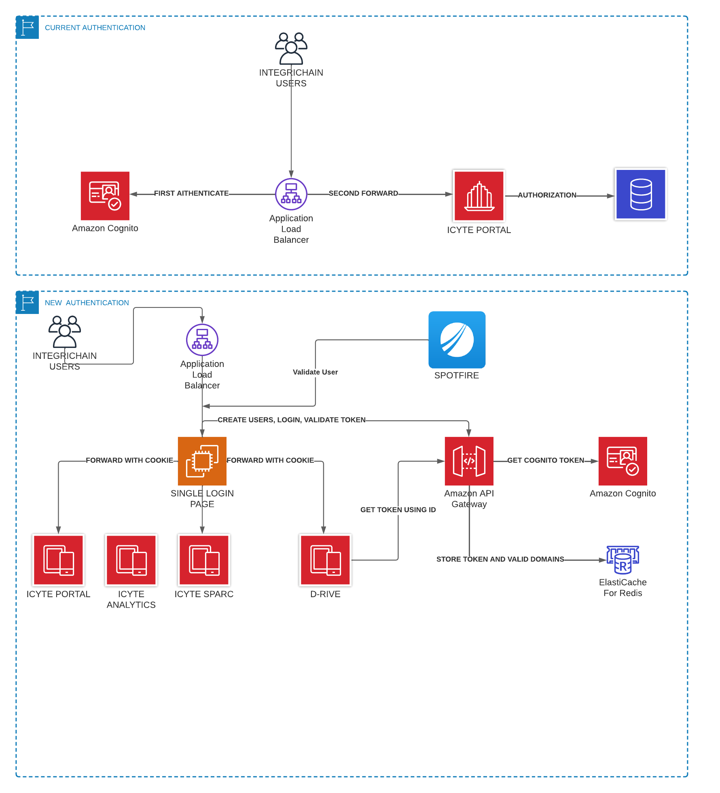

# SSO API

## System Overview
Single sign on API is a REST API to manage authentication
- [Summary](#summary)
- [Resources](#resources)
- [System Diagrams](#diagrams)
- [Service Map](#map)
- [SetUp Instructions](#setup)
- [Usage](#usage)
# Summary
1. Review the documentation of the API:  
  `https://[env]-sso-api.integrichain.net/docs`
2. Create users with the new users endpoint
3. Login the users with the login endpoint
4. Extract the token from the cookie `x-icyte-token-auth`
5. Call the /users/me endpoint

# Resources

Resources available in this API:

- ### Health
Endpoint to test the API is Alive.

- ### Default Group
Endpoints to  create users, login, logout and recover password

# System Diagrams
How it works:

# Services Map
| Service Name   |      Identifier      |  Type |
|----------|:-------------:|------:|
| cognito pool|    [env]-sso-pool   |   DYNAMO DB |
| config_secret_manager| [env]/sso-api |    SECRETS MANAGER|
| SSO API| https://[env]-sso-api.integrichain.net |    CUSTOM API(ECS)|
| ECS CLUSTER| [env]-icyte-analytics/[env]/sso-api |   ECS|

# SetUp Instructions
These instructions assume that you are developing code on a host machine, and running the code in a virtual machine, on 
your host machine. 

### Prerequisites
1. Install Python3.9
1. Install pyenv(https://github.com/pyenv/pyenv#installation)

### Locally
The following instructions and commands need to be executed in your computer. 
1. In your terminal install python 3.9 with pyenv
    * Run: `pyenv install <python version>`
1. In your terminal where you want to create a new virtual environment.
    * Run: `pyenv virtualenv <name of venv>`
1. In your terminal activate your virtual environment
    * Run:  `pyenv activate <name of venv>`
1. `cd` to where you want to clone the Icdr-Mdm-Api repository
    * Run: `git clone <icyte-analytics>`
1. Install  dependencies.
     * Run ` pip install -r requirements.txt -i https://5ymwusueh2.us-east-1.awsapprunner.com`
1. Install test  dependencies.
     * Run ` pip install -r requirements.dev.txt -i https://5ymwusueh2.us-east-1.awsapprunner.com  ` 
1. Execute the API in your local machine
     * Run `export config_secret_local_file=config_secret_local.json && python main.py`
     * Run `export config_secret_manager=dev/sso-api && python main.py`
1. Execute the API integration tests in your local machine
     * Set the configuration source from secret manager or local file  `export config_secret_manager=dev/sso-api `
     * To execute all the test Run `pytest -v or pytest -rP`
     * To execute just one test scenario Run `pytest app/tests/integration/test_message_center_with_mock.py -v`
     * To Execute the test scenarios with coverage Run `coverage run  --source=.  -m pytest -v`
     * To generate Coverage Report in the Terminal Run `coverage report`
     * To generate Coverage Report in  HTML format Run `coverage html`
1. Open the browser and check the open api UI to see the API documentation
     * Open the url `http://localhost:8080/docs`
     * Open the url `http://localhost:8080/redoc`

