# SSO API Performance Tests

## System Overview
This project is created to perform tests using JMeter tool

# <a name="setup"></a>Setup Instructions

### Prerequisites
1. Install Java 8 or higher ( https://www.java.com/en/download/help/mac_install.html)
2. Download JMeter tool (https://jmeter.apache.org/download_jmeter.cgi)
3. We need to choose the .zip file in the Source option:

   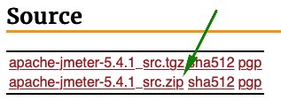
4. Unzip the .zip file and run the jmeter file from /bin folder in console to open JMeter tool:

   `/{path}/apache-jmeter-5.4.1/bin/./jmeter`
### How to run Performance Tests (JMeter UI)
1. Open Jmeter and open sso_api.jmx:

   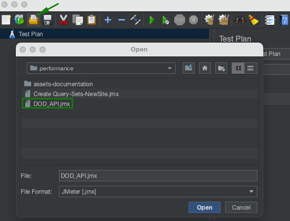

2. Click on thread group, next click on the specify thread lifetime checkbox and next specify how threads, the ramp-up time and the duration of each thread:
   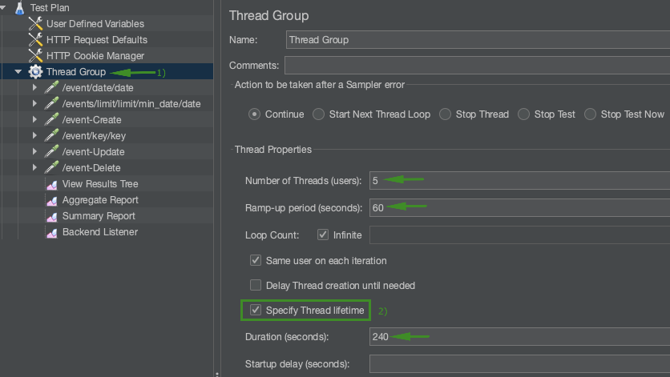
3. Click on view results tree and run the test:

   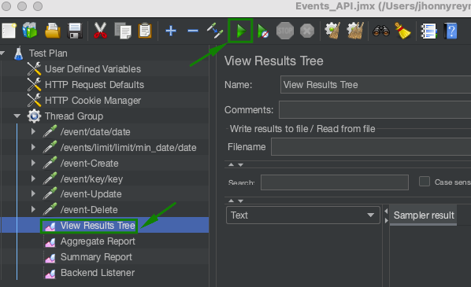

### How to run Performance Tests (JMeter Console)

1. Run the next command in the console:

   `/{path}/apache-jmeter-5.4.1/bin/jmeter -n -t /{path}/sso_api.jmx -l results.jtl`

   Example:
    ```
    /Users/jhonnyreynolds/Documents/apache-jmeter-5.4.1/bin/jmeter -n -t /Users/jhonnyreynolds/Documents/Icyte-analytics/icyte-analytics/events-api/app/tests/performance/sso_api.jmx -l results.jtl
    ```
    
### Run the project with the qa tools API

1. Create a zip file with the contents of the project:
   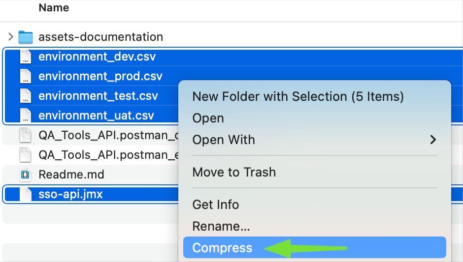
2. Open Postman and import QA_Tools_API.postman_collection.json and QA_Tools_API.postman_environment.json
   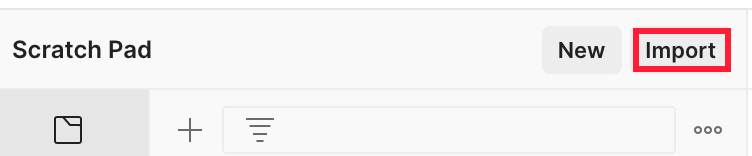
   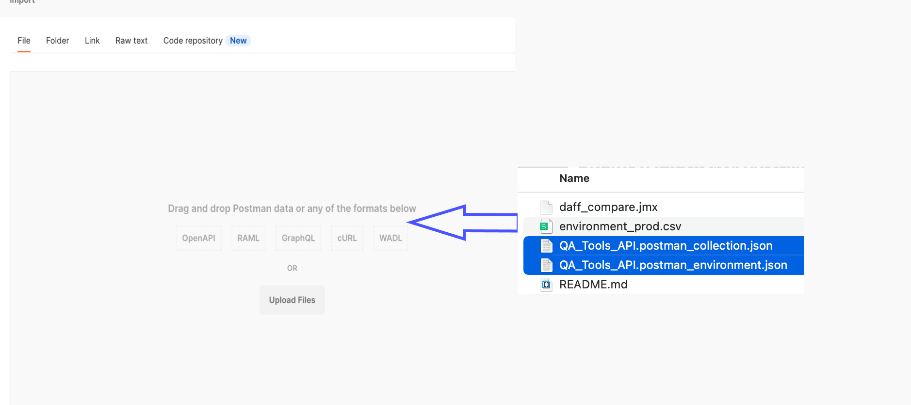
3. Select the qa_tools_api environment: 
   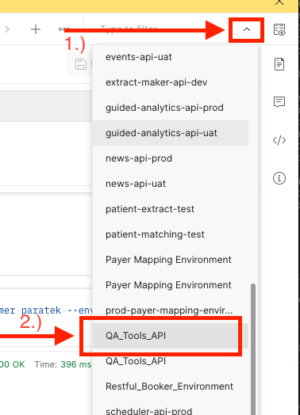
4. Click on the environment quick look button and fill in your integrichain email and username
   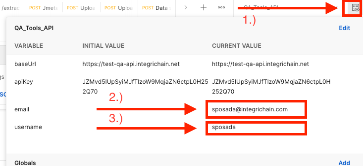
5. Go to Upload File - JMeter and click on select files then find the zip file of the project:
   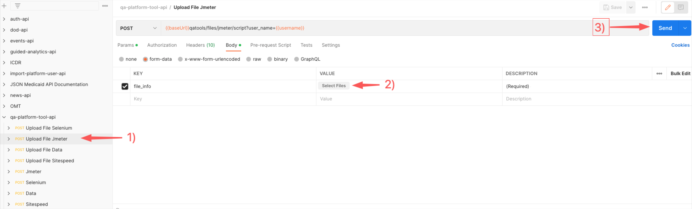
6. Go to JMeter session and in the request body fill in title, python app and param_app parameters:
   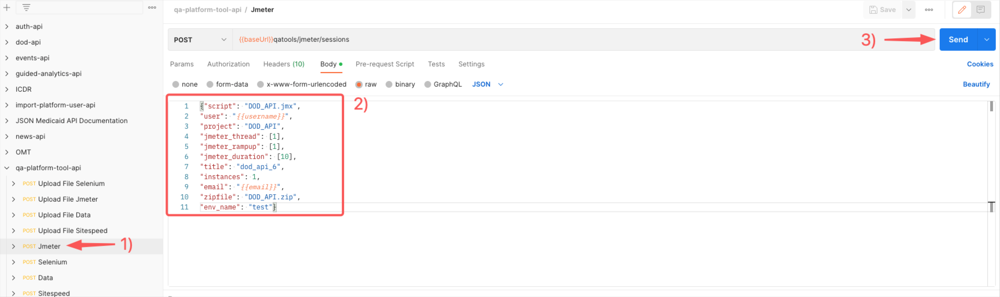

Example request_body:
 ```
   {"script": "sso-api.jmx",
   "user": "jreynolds",
   "project": "sso-api",
   "jmeter_thread": [1],
   "jmeter_rampup": [1],
   "jmeter_duration": [10],
   "title": "sso-api_1",
   "instances": 1,
   "email": "jreynolds@integrichain.com",
   "zipfile": "sso-api.zip",
   "env_name": "test"}
```
