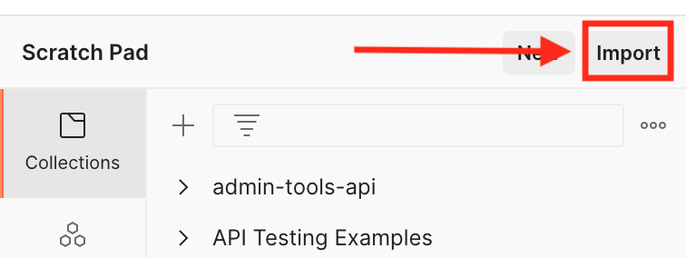

## Setup Instructions

### Prerequisites

1.  Install Postman (<https://learning.postman.com/docs/getting-started/installation-and-updates/#installing-postman-on-mac>)

### How to run

1. Open Postman. Import sso-verify-user.postman_collection.json and single-sign-on-service postman environment
   
   
   
   
   
   

2. Select the environment and Click on verify user:
   
   
   
   
3. Fill in the value for email under Path Variables and save the request
   
   
   
4. Run the collection, click on the three dots, next click on run collection
   
   
   
   
