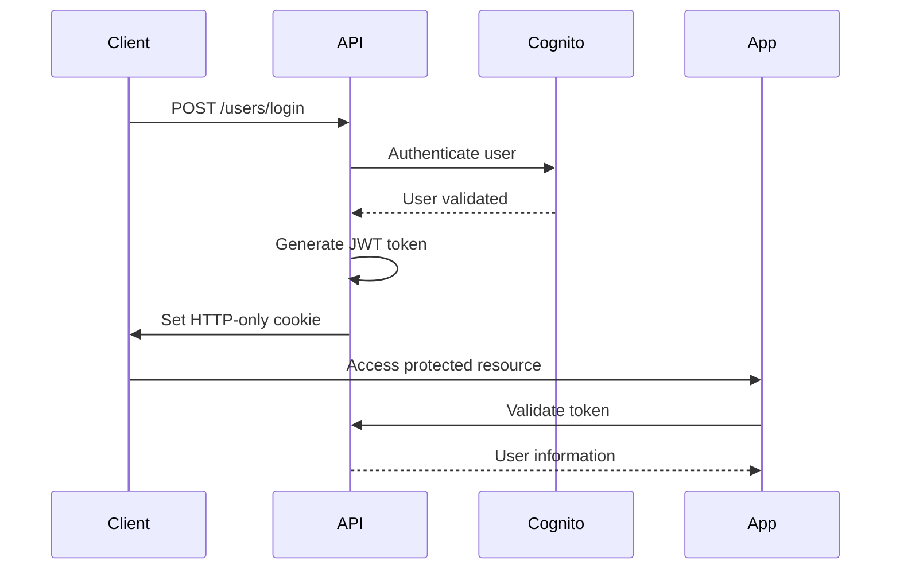
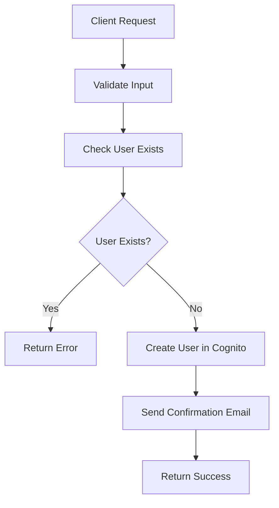
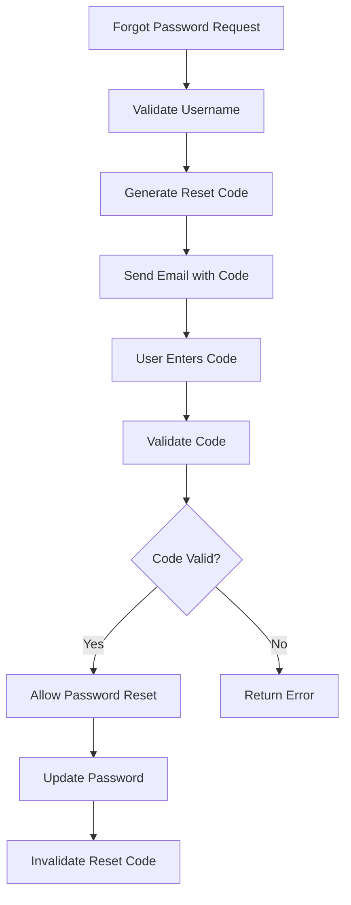
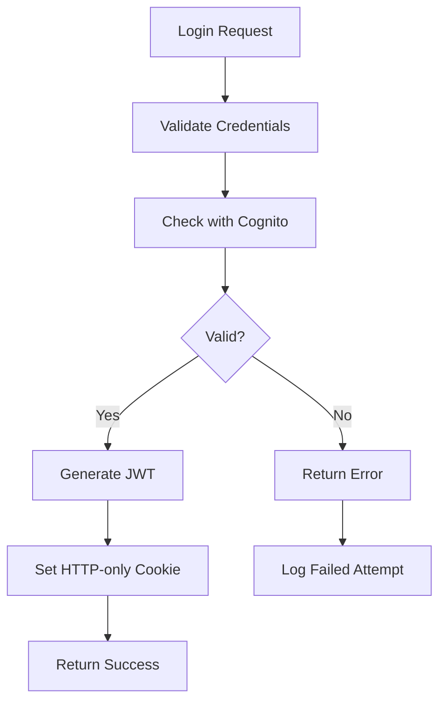

# SSO API Architecture Guide

## Table of Contents
- [System Overview](#system-overview)
- [Architecture Components](#architecture-components)
- [Security Model](#security-model)
- [JWT Token Management](#jwt-token-management)
- [External Identity Provider Integration](#external-identity-provider-integration)
- [Data Flow Diagrams](#data-flow-diagrams)
- [Deployment Architecture](#deployment-architecture)
- [Performance Considerations](#performance-considerations)

## System Overview

The SSO API is a microservice-based authentication system built with FastAPI that provides centralized authentication and authorization for Integrichain applications. It follows a stateless JWT-based authentication model with support for external identity providers.

### Key Design Principles

- **Stateless Authentication**: JWT tokens eliminate the need for server-side session storage
- **Microservice Architecture**: Modular design with clear separation of concerns
- **Security First**: Implementation of security best practices throughout
- **Cloud Native**: Designed for containerized deployment on AWS
- **Scalable**: Horizontal scaling support with load balancing

## Architecture Components

### Core Components

```
┌─────────────────────────────────────────────────────────────┐
│                    Load Balancer (ELB)                     │
└─────────────────────┬───────────────────────────────────────┘
                      │
┌─────────────────────▼───────────────────────────────────────┐
│                 API Gateway                                 │
└─────────────────────┬───────────────────────────────────────┘
                      │
    ┌─────────────────▼─────────────────┐
    │          SSO API Service          │
    │        (FastAPI + uvicorn)        │
    └─────────────────┬─────────────────┘
                      │
    ┌─────────────────▼─────────────────┐
    │          Service Layer            │
    │  ┌─────────────────────────────┐  │
    │  │     Authentication Service  │  │
    │  │     User Management Service │  │
    │  │     Password Service        │  │
    │  │     External Provider Svc   │  │
    │  └─────────────────────────────┘  │
    └─────────────────┬─────────────────┘
                      │
    ┌─────────────────▼─────────────────┐
    │          Data Layer               │
    │  ┌─────────────────────────────┐  │
    │  │     AWS Cognito User Pool   │  │
    │  │     AWS Secrets Manager     │  │
    │  │     AWS DynamoDB            │  │
    │  └─────────────────────────────┘  │
    └───────────────────────────────────┘
```

### Service Layer Components

#### 1. Authentication Service (`app/services/auth.py`)
- JWT token generation and validation
- Session management
- Authentication middleware

#### 2. User Management Service (`app/services/users.py`)
- User CRUD operations
- User profile management
- User status management

#### 3. Password Service (`app/services/passwords.py`)
- Password validation and hashing
- Password reset workflows
- Password policy enforcement

#### 4. External Provider Service (`app/services/external_providers.py`)
- SAML integration
- OAuth/OIDC integration
- Provider-specific authentication flows

#### 5. Login Service (`app/services/login.py`)
- Login workflow orchestration
- Multi-factor authentication support
- Login attempt tracking

### Router Layer

The API uses FastAPI routers to organize endpoints:

```python
# Router organization
/users/
├── login_actions.py      # Login/logout endpoints
├── password_actions.py   # Password management
├── users_actions.py      # User CRUD operations
└── import_actions.py     # Bulk user operations

/health/
└── health.py            # Health check endpoints

/saml/
└── external_providers_actions.py  # IDP integration
```

## Security Model

### Authentication Flow



### Security Features

#### 1. JWT Token Security
- **HTTP-only cookies**: Prevents XSS attacks
- **Secure flag**: HTTPS-only transmission
- **SameSite attribute**: CSRF protection
- **Short expiration**: Minimizes exposure window
- **Signed tokens**: Prevents tampering

#### 2. Password Security
- **Hashing**: bcrypt with salt
- **Complexity requirements**: Enforced by AWS Cognito
- **Reset tokens**: Time-limited and single-use
- **Brute force protection**: Rate limiting

#### 3. CORS Configuration
```python
app.add_middleware(
    CORSMiddleware,
    allow_origins=config.get('API_ORIGIN', '*').split(','),
    allow_credentials=True,
    allow_methods=["*"],
    allow_headers=["*"],
)
```

#### 4. Input Validation
- **Pydantic models**: Automatic validation and serialization
- **SQL injection prevention**: Parameterized queries
- **XSS prevention**: Input sanitization

## JWT Token Management

### Token Structure

```json
{
  "header": {
    "alg": "HS256",
    "typ": "JWT"
  },
  "payload": {
    "sub": "user-id",
    "username": "user@example.com",
    "email": "user@example.com",
    "iat": 1641234567,
    "exp": 1641238167,
    "iss": "sso-api",
    "aud": "integrichain-apps"
  },
  "signature": "signature-hash"
}
```

### Token Lifecycle

1. **Generation**: On successful login
2. **Storage**: HTTP-only cookie (`x-icyte-token-auth`)
3. **Validation**: On each protected request
4. **Refresh**: Automatic on valid requests (optional)
5. **Expiration**: 1 hour default
6. **Revocation**: On explicit logout

### Cookie Configuration

```python
# Secure cookie settings
cookie_settings = {
    "httponly": True,      # Prevent JavaScript access
    "secure": True,        # HTTPS only
    "samesite": "strict",  # CSRF protection
    "max_age": 3600,       # 1 hour expiration
    "domain": ".integrichain.net"  # Domain scope
}
```

## External Identity Provider Integration

### SAML 2.0 Integration

#### Architecture
```
┌─────────────┐     ┌─────────────┐     ┌─────────────┐
│   Browser   │────▶│  SSO API    │────▶│     IDP     │
│             │     │             │     │   (SAML)    │
└─────────────┘     └─────────────┘     └─────────────┘
       │                   │                   │
       │                   │                   │
       ▼                   ▼                   ▼
1. Request login    2. Redirect to IDP  3. Authenticate
4. SAML Response    5. Process assertion 6. Create session
```

#### SAML Flow
1. **SP-Initiated SSO**: User accesses `/saml/login`
2. **Authentication Request**: Redirect to Identity Provider
3. **User Authentication**: User logs in at IDP
4. **SAML Response**: IDP posts assertion to `/saml/acs`
5. **Token Generation**: Create JWT token from SAML attributes
6. **Session Creation**: Set authentication cookie

### OAuth 2.0 / OpenID Connect

#### Supported Providers
- Google
- Microsoft Azure AD
- GitHub
- Custom OAuth providers

#### OAuth Flow
```python
# OAuth configuration example
oauth_config = {
    "google": {
        "client_id": "client-id",
        "client_secret": "client-secret",
        "authorization_url": "https://accounts.google.com/o/oauth2/auth",
        "token_url": "https://oauth2.googleapis.com/token",
        "userinfo_url": "https://www.googleapis.com/oauth2/v2/userinfo",
        "scopes": ["openid", "email", "profile"]
    }
}
```

## Data Flow Diagrams

### User Registration Flow



### Password Reset Flow



### Authentication Flow



## Deployment Architecture

### AWS ECS Deployment

```yaml
# ECS Task Definition (simplified)
version: '3'
services:
  sso-api:
    image: sso-api:latest
    ports:
      - "8000:8000"
    environment:
      - config_secret_manager=prod/sso-api
      - AWS_REGION=us-east-1
    healthcheck:
      test: ["CMD", "curl", "-f", "http://localhost:8000/health"]
      interval: 30s
      timeout: 10s
      retries: 3
```

### Infrastructure Components

#### 1. Application Load Balancer (ALB)
- SSL termination
- Health checks
- Request routing
- Sticky sessions (if needed)

#### 2. ECS Cluster
- Auto-scaling based on CPU/memory
- Multiple availability zones
- Rolling deployments
- Container health monitoring

#### 3. AWS Cognito User Pool
- User storage and management
- Password policies
- MFA support
- Federation with external providers

#### 4. AWS Secrets Manager
- Configuration management
- Database credentials
- API keys
- Automatic rotation

#### 5. CloudWatch
- Application logging
- Performance metrics
- Alerting
- Dashboards

### Environment Configuration

```json
{
  "production": {
    "API_ORIGIN": "https://prod-app.integrichain.net",
    "JWT_SECRET_KEY": "stored-in-secrets-manager",
    "COGNITO_USER_POOL_ID": "us-east-1_xxxxxxxxx",
    "COGNITO_CLIENT_ID": "xxxxxxxxxxxxxxxxxxxxxxxxxx",
    "LOG_LEVEL": "INFO"
  },
  "staging": {
    "API_ORIGIN": "https://staging-app.integrichain.net",
    "JWT_SECRET_KEY": "stored-in-secrets-manager",
    "COGNITO_USER_POOL_ID": "us-east-1_yyyyyyyyy",
    "COGNITO_CLIENT_ID": "yyyyyyyyyyyyyyyyyyyyyyyyyy",
    "LOG_LEVEL": "DEBUG"
  }
}
```

## Performance Considerations

### Optimization Strategies

#### 1. Caching
- **JWT Token Validation**: Cache valid tokens for short periods
- **User Information**: Cache user profiles
- **Configuration**: Cache application settings

#### 2. Connection Pooling
- **Database Connections**: Reuse connections to reduce overhead
- **HTTP Clients**: Connection pooling for external API calls

#### 3. Asynchronous Processing
- **Email Sending**: Queue email notifications
- **Audit Logging**: Asynchronous log processing
- **User Import**: Background processing for bulk operations

#### 4. Monitoring and Metrics

```python
# Example metrics collection
from prometheus_client import Counter, Histogram

login_attempts = Counter('login_attempts_total', 'Total login attempts', ['status'])
request_duration = Histogram('request_duration_seconds', 'Request duration')

@request_duration.time()
def process_login(username, password):
    try:
        # Login logic
        login_attempts.labels(status='success').inc()
    except Exception:
        login_attempts.labels(status='failure').inc()
        raise
```

### Scaling Considerations

#### Horizontal Scaling
- **Stateless Design**: No server-side sessions
- **Load Balancing**: Round-robin or least connections
- **Database Scaling**: Read replicas for user queries

#### Vertical Scaling
- **Memory Optimization**: Efficient data structures
- **CPU Optimization**: Async processing where possible
- **I/O Optimization**: Connection pooling and caching

### Performance Monitoring

#### Key Metrics
- **Response Time**: Average and 95th percentile
- **Throughput**: Requests per second
- **Error Rate**: 4xx and 5xx responses
- **Authentication Success Rate**: Login success/failure ratio

#### Alerting Thresholds
- Response time > 2 seconds
- Error rate > 1%
- Authentication failure rate > 5%
- Memory usage > 80%
- CPU usage > 70%

This architecture ensures a secure, scalable, and maintainable authentication system that can handle enterprise-level requirements while providing excellent performance and reliability.